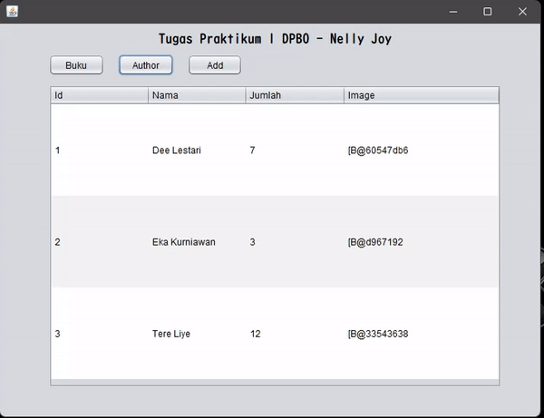
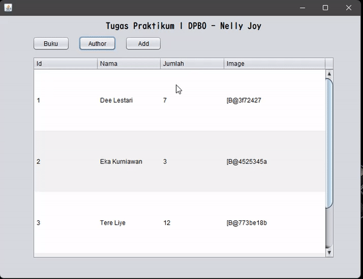
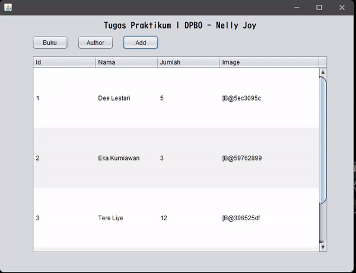
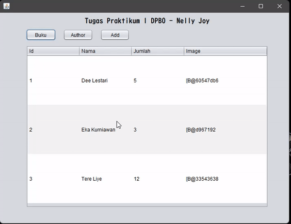

## TP1DPBO2022

Janji

>Saya Nelly Joy Christi Simanjuntak 2000199 mengerjakan TP1 dalam mata kuliah Desain dan Pemrograman Berorientasi Objek untuk keberkahanNya maka saya tidak melakukan kecurangan seperti yang telah dispesifikasikan. Aamiin

#### TP1 - Java GUI
Pada tugas ini terdapat file jar (didalam folder 'build_result_jar') yang merupakan hasil tugas yang telah saya kerjakan. Untuk source code juga dilampirkan pada folder 'TP1DPBO_JavaSourceCode' yang sudah di build dengan file .jar yang berada dalam folder 'dist'. Berikut penjelasan mengenai apa yang telah saya kerjakan beserta dokumentasi hasilnya.

1. Membuat 2 kelas dalam bentuk tabel database yaitu tabel Author (tb_author) dan tabel Buku (tb_buku) serta terintegrasi dengan database MySQL.
   >File database terdapat dalam folder SQL_database dengan nama file 'dbtp1'. 
2. Komponen tiap tabel telah ditampilkan dalam bentuk tabel dengan menggunakan buttun 'Add' untuk mengganti tabel yang ingin ditampilkan
   >Hasil terdapat pada video di poin 4
3. Terdapat button Buku dan Author yang digunakan untuk melakukan input data, jika button diklik maka akan menampilkan jFrame yang berisi Form atribut kelas.
   >Hasil terdapat pada video di poin 4
4. Untuk melakukan update dan delete data pada tabel, tinggal klik data maka akan muncul Jframe yang berisi atribut data yang diklik. Ubah data lalu klik button Update untuk melakukan update data. Klik button delete untuk menghapus data.
   >Berikut Video hasil pengerjaan poin 2, 3, dan 4.
   >
5. Melakukan add, update dan delete data pada tabel, akan dicontohkan menggunakan data pada tabel
   - Ketika button buku/author diklik maka akan muncul jFrame berisi form untuk menambahkan data. Klik Add untuk menambahkan data dan menutup jFrame. Klik add untuk refresh data pada tabel. 
     
   - Ketika data pada tabel diklik, akan muncul jFrame yang berisi atribut data dan memiliki tombol Update dan delete. Klik Update untuk melakukan update dan menutup jFrame. 
     
   - Ketika data pada tabel diklik, akan muncul jFrame yang berisi atribut data dan memiliki tombol Update dan delete. Klik Delete untuk menghapus data dan menutup jFrame. 
     
5. Terdapat Validasi apabila atribut yang penting masih kosng atau belum terisi 
   
6. Untuk gambar belum dapat saya tampilkan karna masih belum terlalu paham, untuk selanjutnya akan saya coba pelajari lagi cara menampilkan gambar yang terdapat pada database MySQL.
   

###### Sekian tugas saya, mohon maaf apabila masih terdapat banyak kesalahan atau kekurangan. Terima kasih.
